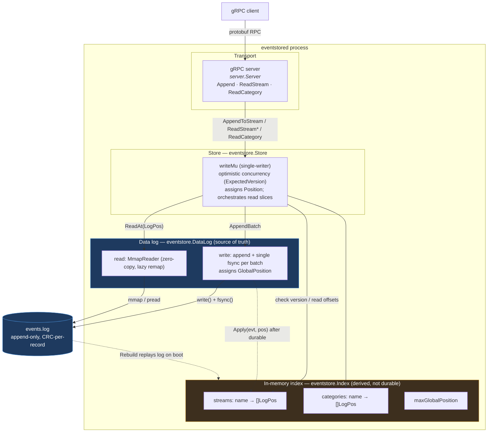
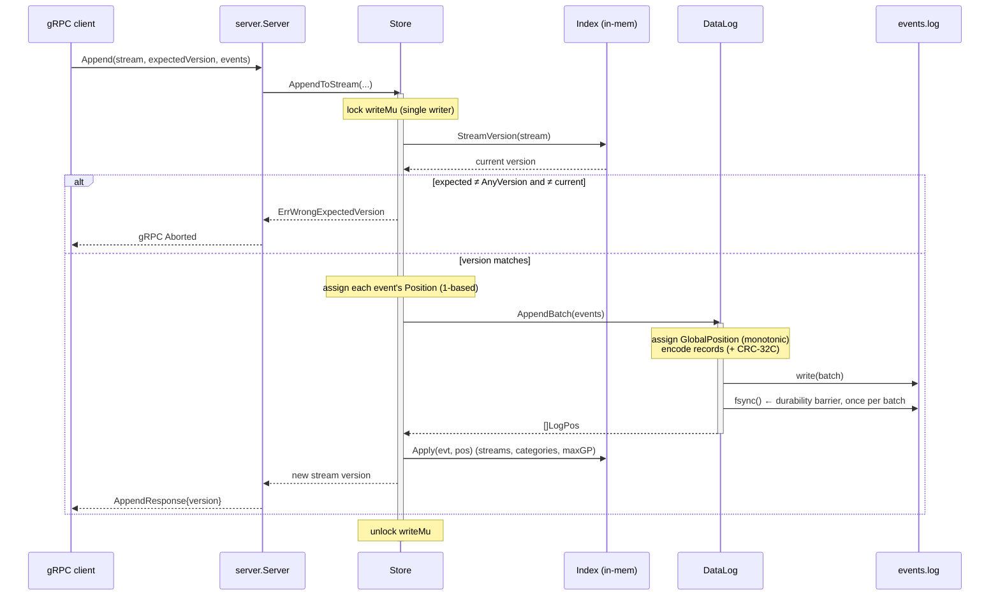
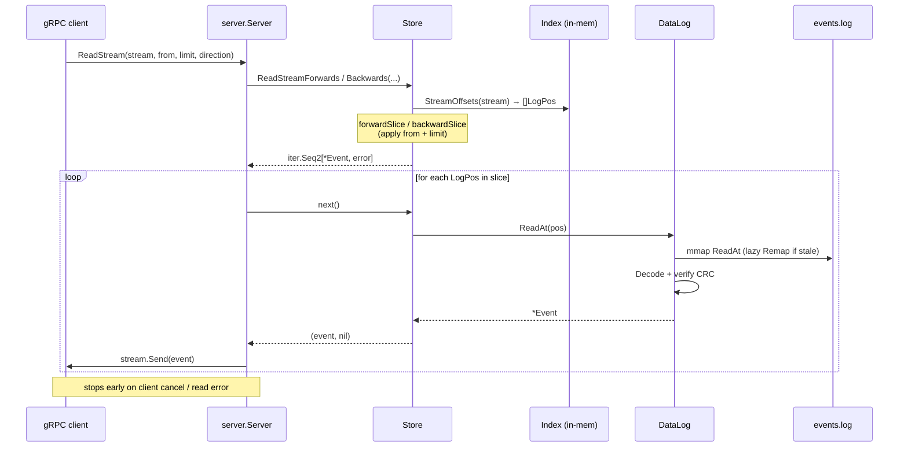
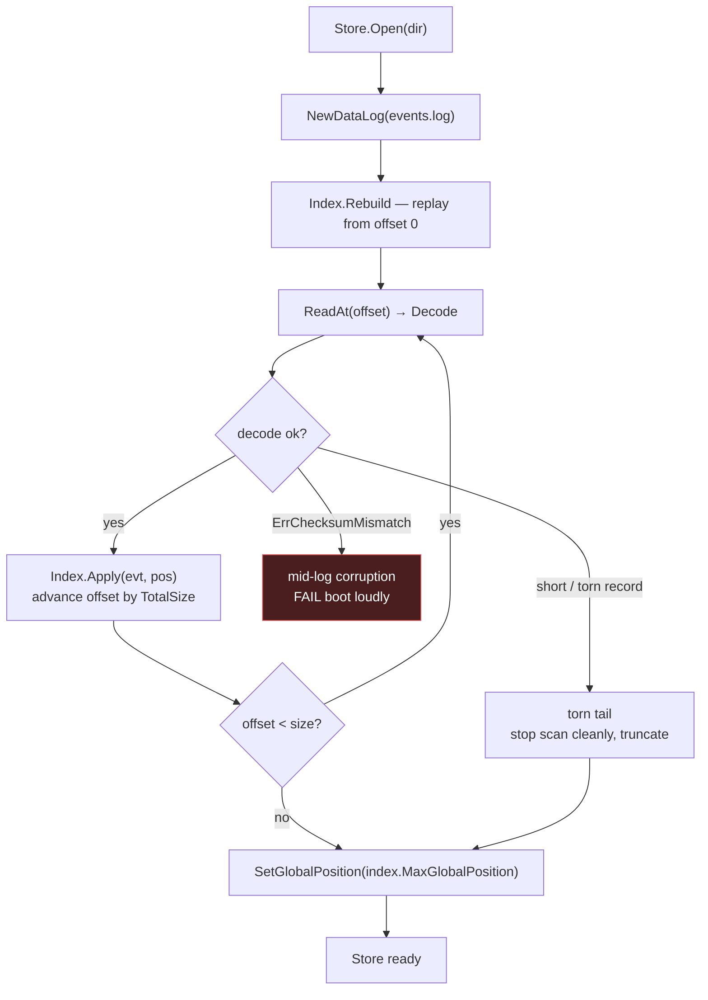
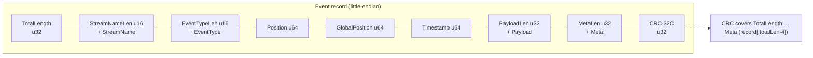
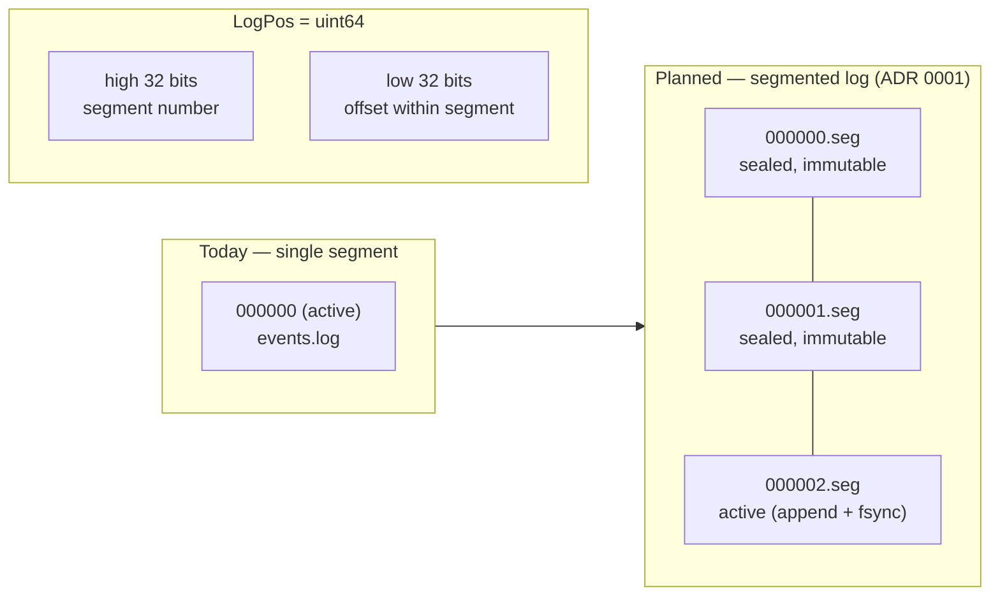

# Architecture

An append-only event store. The **data log** on disk is the single source of
truth; the **index** is a derived, in-memory view rebuilt by replaying the log on
boot. Writes are single-writer with optimistic concurrency control; reads are
served as fallible iterators over log positions.

See the ADRs for the decisions behind the design:
[0001 — segmented log with pread reads](adr/0001-segmented-append-only-log-with-pread-reads.md),
[0002 — per-record CRC](adr/0002-per-record-crc-for-corruption-detection.md).

## Component overview

## Write path — `AppendToStream`

A batch is checked against the in-memory stream tip, appended to the log with a
single fsync, and only then reflected in the index. The `writeMu` mutex makes the
check-then-append critical section atomic (single writer).

## Read path — stream / category iterators

Reads never take the write lock. The store resolves an ordered slice of `LogPos`
from the index, then streams each record from the log as an
`iter.Seq2[*Event, error]`. gRPC forwards each event to the client, stopping early
on client disconnect.

## Boot / recovery — `Store.Open`

The index holds no durable state. On open, the log is replayed from offset 0;
each complete record is applied to the index. A **torn tail** (partial trailing
record from a crash between write and fsync) stops the scan cleanly, whereas a
**CRC mismatch** is real corruption and fails the boot loudly.

## On-disk record format

Each record is length-prefixed and ends with a CRC-32C over every preceding byte
(length prefix included). Trailing placement means a short/torn write fails the
length check (recoverable) while a bit-flip in a complete record fails the CRC
check (unrecoverable) — see [ADR 0002](adr/0002-per-record-crc-for-corruption-detection.md).

## Log positions & segmentation (planned)

A `LogPos` packs a 32-bit segment number and a 32-bit in-segment byte offset into
one `uint64`, keeping the index at 8 bytes per entry. Today there is a single
segment (number 0); [ADR 0001](adr/0001-segmented-append-only-log-with-pread-reads.md)
evolves this into numbered fixed-size segment files (one active, the rest sealed
and immutable) to enable retention, backup, and clustering.

